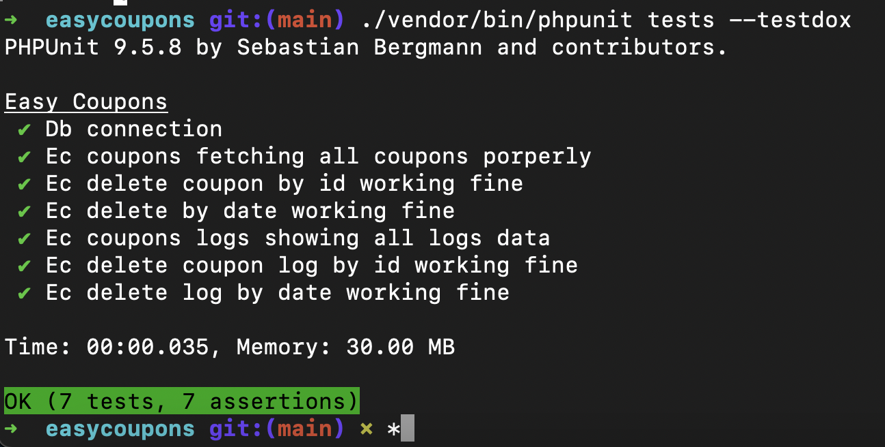

# WP Easy Coupons

Wordpress plugin to allow user watch videos via Coupon Codes

## How to use
```
https://www.loom.com/share/c6723b0675bc4dcd872edbddd01b6a69

```

## Requirements (with estimation)

- [x] Create a plugin called "Easy Coupons" with the following features:
    - [x] As an admin, I should be able to bulk generate any quantity of randomly generated, unique 4 character alpha-numeric coupon codes (ex. f5Ba, 891d, etc.) - **5 hours**
    - [x] As an admin, I should be able to search and delete any individual coupon code - **1 hours**
    - [x] As an admin, I should be able to specify an expiry date when I generate coupon codes  - **1 hours**
    - [x] As an admin, I should be able to bulk delete coupons based on expiry date  - **2 hours**
- [x] Create a page with 3 gated educational YouTube videos
    - [x] As a visitor, to unlock and display a single video I should be able to enter a single valid coupon code (found in the database and future expiry) - **3 hours**
    - [x] As a visitor, I should receive an error message if I attempt to use the same coupon code more than once - **2hours**
    - [x] As a visitor, I should continue to have access to a video after I enter a valid coupon code (even if I close the browser and return to the site) - **2 hours**
    - [x] As an admin, I should be able to see which video a coupon code was applied to - **2 hours**
    - [x] As an admin, I should see a report of failed coupon code validations with two categories: not found & already used  - **4 hours**
    - [x] As an admin, I should be able to use the coupon code ADMN unlimited times to access any video  - **2 hours**
- [x] Testing - **4 hours**
    - [x] As a developer, I should be able to test any business logic with automated unit tests
- [x] Styling
    - [x] Create a custom WP theme with the stylesheet of your choice - **4 hours**
    - [x] Add animation to the success and failure states of entering a coupon - **2 hours**
- [x] Documentation - **8 hours**
    - [x] Add code comments as needed to improve the ability for another developer to finish this project
    - [x] Update the README with a brief written summary of what's been completed and what still needs to be done
    - [x] Update the README Any other feedback including which features could be refactored or improved


## TESTS
- To run tests: ./vendor/bin/phpunit tests --testdox
- 

## FUTURE
- cron job / event to automatically check if a coupon expired
